# Blockchain and Cryptocurrencies
## Block change
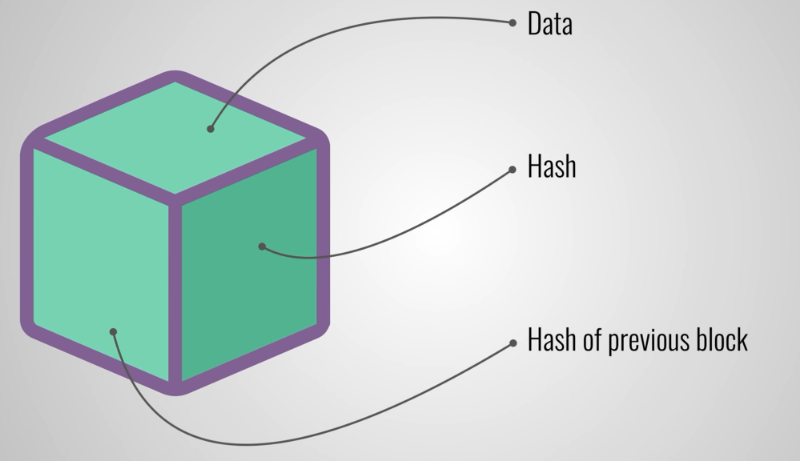

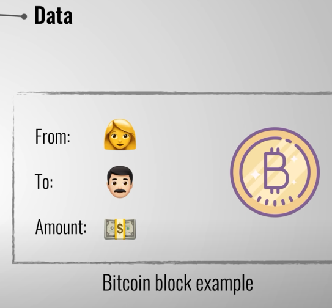
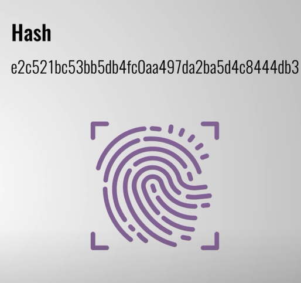
changing something inside changes the hash will be also changed

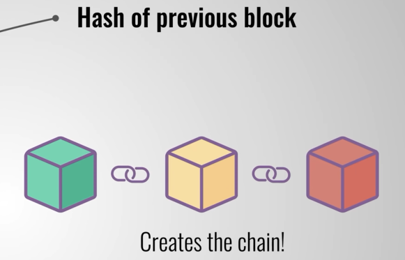

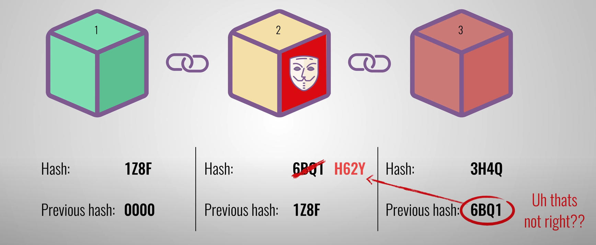

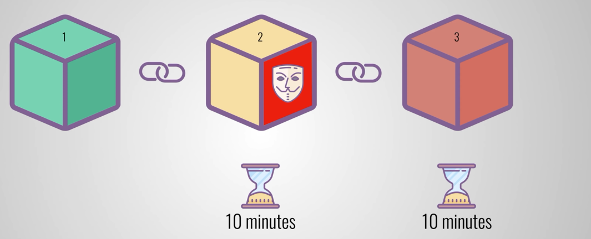
what  is proof of work ?
S

p2p network
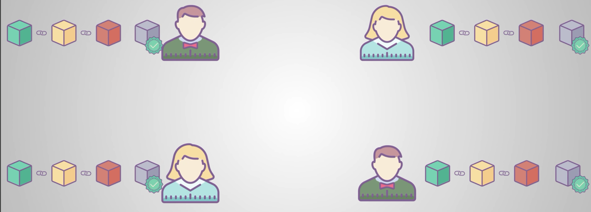
so we need to change in all blocks to hack

this is ledger
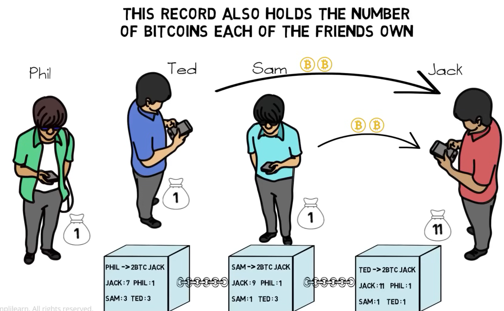

how it finds
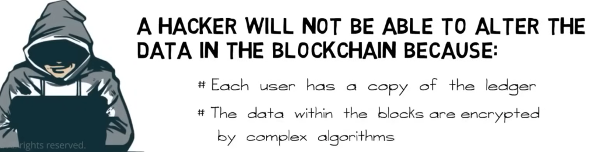
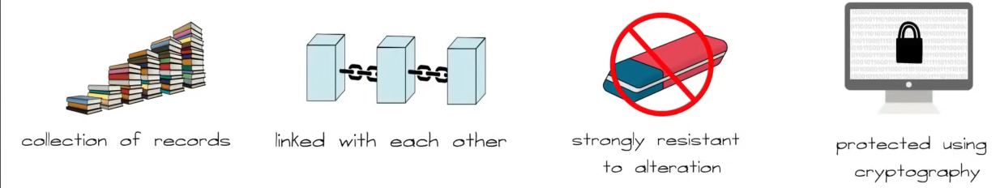

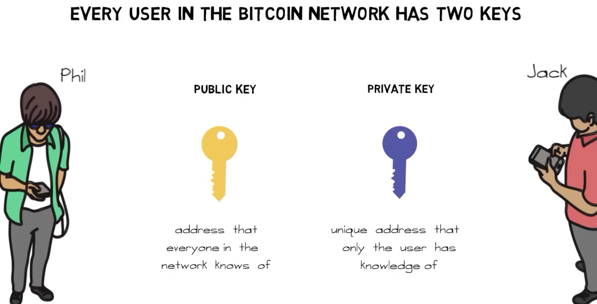

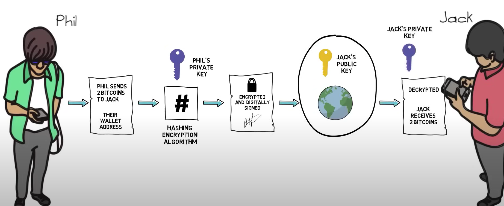

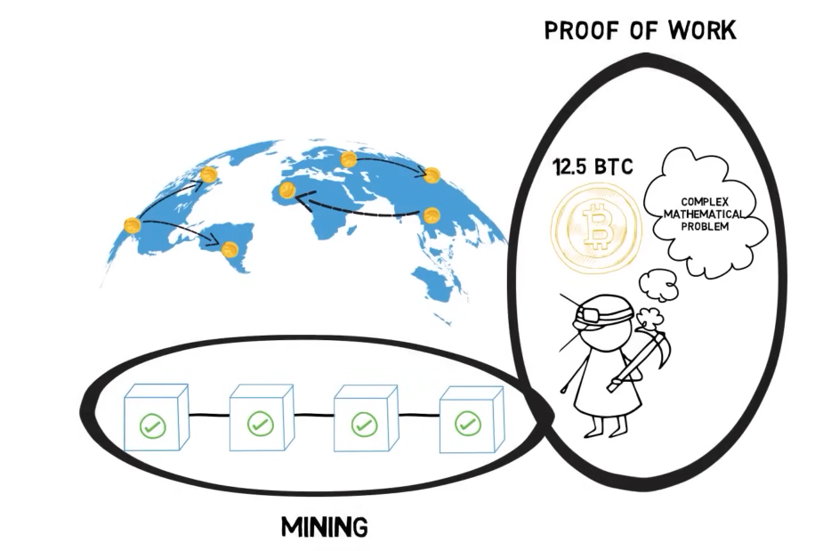
what is mining?
what proof of work